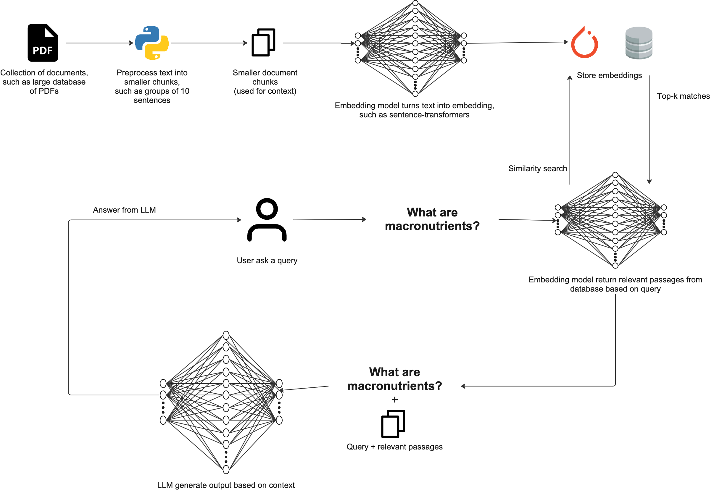

# Local RAG from Scratch

This is my implementation of Retrieval Augmented Generation (RAG) that runs completely locally. I built it as a nutrition textbook chatbot that can answer questions based on a PDF textbook.

## What is RAG?

**RAG** stands for **Retrieval Augmented Generation**:

- **Retrieval**: Find relevant information from documents based on a query
- **Augmented**: Enhance the LLM prompt with the retrieved relevant context
- **Generation**: Generate responses using an LLM based on the augmented prompt

The idea is to help LLMs give more accurate answers by providing them with relevant context from your documents, which reduces hallucinations.

## Project Overview

I built this to demonstrate a complete RAG pipeline from scratch using:

- **PDF Processing**: Extract and chunk text from PDF documents
- **Embeddings**: Convert text chunks into numerical representations for similarity search
- **Vector Search**: Find relevant passages using semantic similarity
- **Local LLM**: Generate responses using a locally-hosted language model

### Why Go Local?

I chose to run everything locally for several reasons:

- **Privacy**: Your data stays on your machine
- **Speed**: No waiting for API calls
- **Cost**: No usage fees
- **Control**: Not dependent on external services

## Repository Structure

```
local-rag/
├── 00-simple-local-rag-video.ipynb    # Main implementation notebook
├── human-nutrition-text.pdf           # Source document (nutrition textbook)
└── text_chunks_and_embeddings_df.csv  # Processed text chunks with embeddings
```

## Getting Started

### What You'll Need

```bash
pip install torch
pip install sentence-transformers
pip install transformers
pip install PyMuPDF  # for PDF processing
pip install pandas
pip install numpy
pip install spacy
pip install tqdm
pip install matplotlib
```

### Running the Code

1. **Clone or download this repository**

2. **Open the Jupyter notebook**:
   ```bash
   jupyter notebook 00-simple-local-rag-video.ipynb
   ```

3. **Run all cells** - this will:
   - Download the nutrition textbook PDF
   - Process and chunk the text
   - Create embeddings
   - Set up the local LLM
   - Let you start asking questions

## How It Works

### Part 1: Document Processing & Embedding Creation

1. **PDF Import**: Downloads and loads the nutrition textbook PDF
2. **Text Extraction**: Extracts text from each page using PyMuPDF
3. **Text Chunking**: Splits text into manageable chunks using spaCy
4. **Embedding Creation**: Converts text chunks to 768-dimensional vectors using `all-mpnet-base-v2`
5. **Storage**: Saves embeddings to CSV for future use

### Part 2: Search & Answer

1. **Query Processing**: Convert user questions into embeddings
2. **Similarity Search**: Find most relevant text chunks using dot product similarity
3. **Context Augmentation**: Format retrieved passages into a structured prompt
4. **Response Generation**: Use local LLM (`Qwen2.5-0.5B-Instruct`) to generate answers

## Key Features

- **Semantic Search**: Finds relevant content based on meaning, not just keywords
- **Local Processing**: Everything runs on your machine
- **Flexible Chunking**: You can adjust how text gets split up
- **Multiple Similarity Metrics**: Supports both dot product and cosine similarity
- **Model Flexibility**: Easy to swap out different embedding models and LLMs
- **Memory Efficient**: Designed to run on regular consumer hardware

## Usage Examples

```python
# Ask questions about nutrition
ask("What are macronutrients and what do they do?")
ask("How often should infants be breastfed?")
ask("What foods are high in fiber?")
ask("What are the symptoms of pellagra?")
```

## Customization

### Using Different Documents

Just replace `human-nutrition-text.pdf` with your own PDF and rerun the embedding creation cells.

### Changing Models

**Embedding Model**:
```python
embedding_model = SentenceTransformer('your-preferred-model')
```

**Language Model**:
```python
model_id = "your-preferred-llm-model"
```

### Adjusting Chunk Size

```python
num_sentence_chunk_size = 10  # Modify this value
min_token_length = 30         # Adjust minimum chunk length
```

## Performance Notes

- **Embedding Model**: `all-mpnet-base-v2` (768 dimensions)
- **LLM**: `Qwen2.5-0.5B-Instruct` (~0.5B parameters)
- **Search Time**: About 0.01 seconds for 500+ text chunks
- **Memory Usage**: Works well on consumer GPUs (4-8GB VRAM)

## Technical Details

### Text Processing Pipeline

1. **PDF → Raw Text**: PyMuPDF extraction
2. **Raw Text → Sentences**: spaCy sentence segmentation
3. **Sentences → Chunks**: Group sentences into fixed-size chunks
4. **Chunks → Embeddings**: sentence-transformers encoding
5. **Storage**: Pandas DataFrame → CSV

### Similarity Search

Uses dot product similarity between query and document embeddings:
```python
dot_scores = torch.dot(query_embedding, document_embeddings)
top_results = torch.topk(dot_scores, k=5)
```

### Prompt Engineering

The prompting approach includes:
- Clear instructions
- Example responses
- Context formatting
- Space for the model to "think through" the answer

## Use Cases

- **Educational Q&A**: Interactive textbook exploration
- **Document Analysis**: Query large document collections
- **Customer Support**: Knowledge base chatbots
- **Research Assistant**: Find relevant information in academic papers
- **Corporate Knowledge**: Internal documentation search

## Ideas for Future Improvements

- [ ] **Reranking Models**: Improve search result ordering
- [ ] **Vector Databases**: Scale to larger document collections
- [ ] **Hybrid Search**: Combine semantic and keyword search
- [ ] **Multi-modal**: Support for images and tables
- [ ] **Conversation Memory**: Multi-turn conversation support
- [ ] **Web Interface**: Simple web UI for easier interaction

## Useful Resources

- [RAG Paper (Facebook)](https://arxiv.org/abs/2005.11401)
- [Sentence Transformers](https://www.sbert.net/)
- [Hugging Face Transformers](https://huggingface.co/transformers/)
- [Vector Embeddings Guide](https://vickiboykis.com/what_are_embeddings/)
- [Prompt Engineering Guide](https://www.promptingguide.ai/)

## License

This project is open source and available under the MIT License.

## Contributing

Feel free to submit issues, fork the repository, and create pull requests for any improvements.

---

Built for learning and experimenting with local AI systems.
